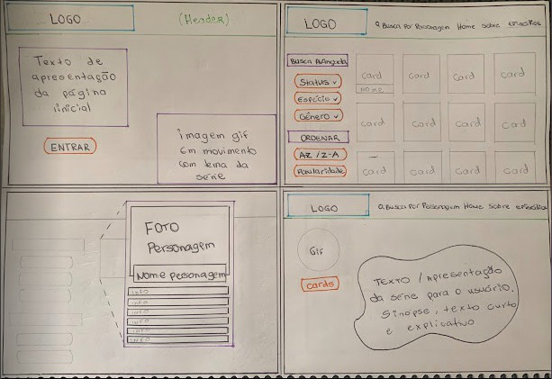
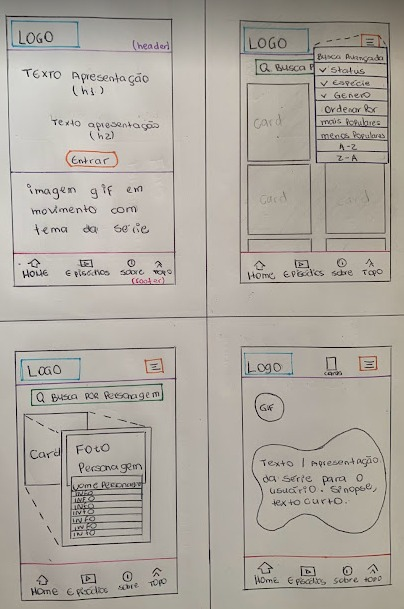
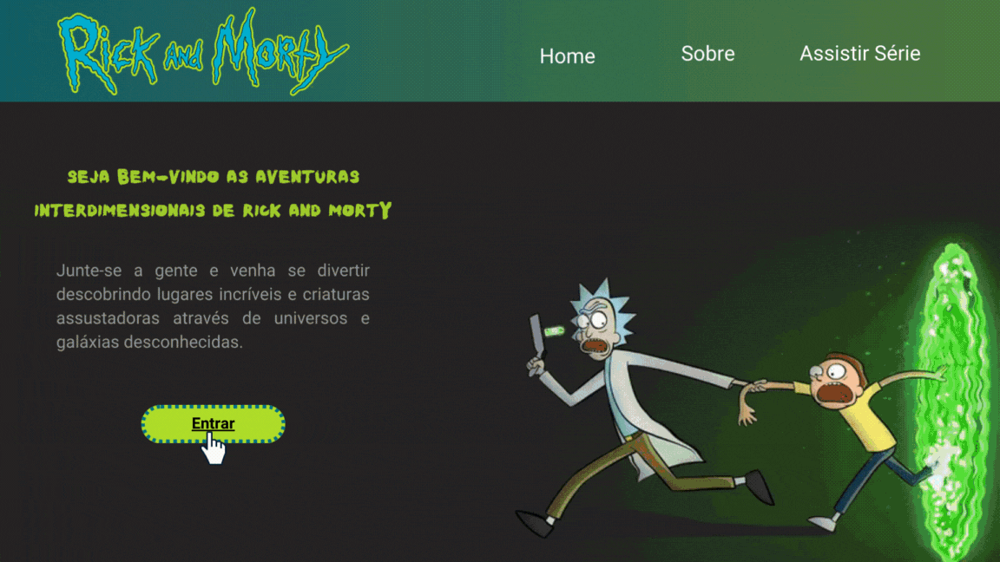
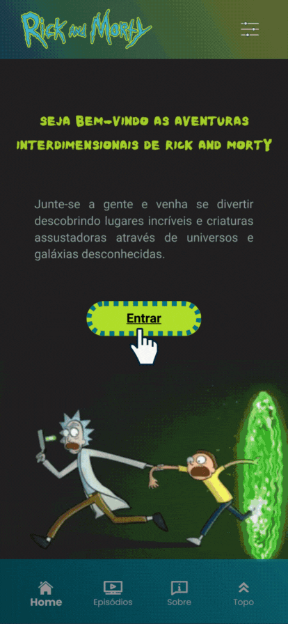

# Data Lovers

## Índice

* [1. Prefácio](#1-prefácil)
* [2. Resumo do projeto](#2-resumo-do-projeto)
* [3. Histórias de usuário](#3-histórias-de-usuário)
* [4. Desenho de interface do usuário](#4-desenho-de-interface-do-usuário)
* [5. Interface do projeto e objetivos alcançados](#5-interface-do-projeto-e-objetivos-alcançados)
* [6. Instruções de uso](#6-instruções-de-uso)
* [7. Testes unitários](#7-testes-unitários)
* [8. Especificações Técnicas](#8-especificações-técnicas)
* [9. Implementações futuras](#9-implementações-futuras)
* [10. Referências](#10-referências)
* [11. Desenvolvedoras](#11-desenvolvedoras)

***

***

## 1. Prefácio

Este projeto foi desenvolvido como parte do bootcamp da Laboratória e consiste em um projeto de nível 2 de um catálogo de projetos de complexidade crescente, associados a objetivos de aprendizagem concretos. Portanto, se trata de uma aplicação web, tendo como principal objetivo permitir ao usuário visualizar e interagir com um conjunto (set) de dados, possibilitando pesquisar, filtrar e ordenar de acordo com às suas necessidades. Aos dados foi utilizado cálculo agregado (porcentagem) para mostrar a informação mais relevante. 

## 2. Resumo do projeto

O produto em questão é uma aplicação web desenvolvida para atender às necessidades daqueles que desejam explorar mais profundamente os personagens da famosa série "Rick and Morty". Com uma abordagem centrada nos entusiastas da série, incluindo tanto fãs casuais que desejam saber mais sobre os personagens quanto fãs assíduos que desejam aprofundar seu conhecimento sobre o universo da série, a aplicação visa proporcionar uma experiência envolvente e informativa para os usuários enquanto exploram os detalhes e nuances dos personagens. 

Na interface da aplicação, os dados mais relevantes que os usuários desejam ver incluem detalhes como o nome dos personagens, seu gênero, espécie, status vital e, também, uma indicação do índice de popularidade, além de poder fazer uma busca pelo nome completo ou parcial do personagem. A visualização dessas informações em um formato claro e de fácil compreensão é essencial para a usabilidade da aplicação, permitindo aos usuários entender a dinâmica da série e como os personagens evoluem ao longo do tempo. 

## 3. Histórias de usuário

As histórias de usuário definiram os requisitos principais para a criação da aplicação web de exploração dos personagens da série "Rick and Morty". Cada história se concentra em uma funcionalidade específica, tornando a experiência do usuário mais completa e agradável.

### História de Usuário 1 - Pesquisa por personagem

Como um fã da série "Rick and Morty", eu quero poder pesquisar por personagens usando nomes completos ou parciais, para que eu possa encontrar personagens específicos com facilidade.

#### Critérios de Aceitação:

*	A plataforma do site deve conter uma barra de pesquisa claramente visível.
*	Os usuários devem poder digitar o nome completo ou parcial do personagem na barra de pesquisa.
*	Ao realizar a pesquisa, o site deve exibir uma lista de personagens correspondentes aos critérios de pesquisa.
*	Os resultados da pesquisa devem ser apresentados de forma organizada e legível.
*	Caso a pesquisa não retorne nenhum resultado, o site deve exibir uma mensagem de feedback apropriada, informando ao usuário que nenhum personagem foi encontrado.

#### Definição de Pronto:

A história de usuário "Pesquisa por Personagem" estará pronta quando:
*	A barra de pesquisa estiver implementada e visível na página do site.
*	Os usuários puderem digitar nomes completos ou parciais de personagens na barra de pesquisa.
*	A pesquisa retornar resultados relevantes, exibindo uma lista organizada de personagens correspondentes aos critérios de pesquisa.
*	Os resultados da pesquisa estiverem apresentados de maneira legível.
*	A funcionalidade de pesquisa se adaptar corretamente a diferentes dispositivos e tamanhos de tela.
*	Testes de usabilidade forem realizados para verificar a eficiência e a experiência do usuário na pesquisa por personagem, como também testes de compatibilidade em diferentes dispositivos.
*	A documentação relevante for atualizada para refletir as mudanças implementadas.
*	A história de usuário passar por revisão e aprovação em teste unitário, assegurando que atende aos critérios de aceitação definidos.

### História de Usuário 2 - Busca Avançada:

Como usuário, eu quero poder realizar uma busca avançada por personagens da série "Rick and Morty" com base em diferentes critérios, como status, espécie e gênero, para encontrar personagens específicos de acordo com minhas preferências.

#### Critérios de Aceitação:

* A plataforma deve fornecer uma interface de busca avançada clara e intuitiva, onde os usuários possam selecionar os critérios desejados.
*	A busca por status deve apresentar as opções "vivo", "morto" e "desconhecido". Ao selecionar uma opção, os personagens correspondentes devem ser exibidos.
*	A busca por espécie deve permitir a seleção de espécies específicas (ex.: humano, alienígena, robô etc.) a partir de uma lista predefinida, e os personagens correspondentes devem ser exibidos.
*	A busca por gênero deve oferecer as opções "masculino", "feminino" e "sem gênero". A seleção de uma opção deve resultar na exibição dos personagens correspondentes.
*	Os resultados da busca avançada devem ser apresentados de maneira organizada.

#### Definição de Pronto:

A história de usuário "Busca Avançada" estará pronta quando:

*	A interface de busca avançada estiver implementada e acessível para os usuários.
*	As opções de busca por status, espécie e gênero estiverem funcionando corretamente.
*	Os resultados da busca avançada estiverem exibindo os personagens de acordo com os critérios selecionados.
*	Os resultados forem apresentados de forma organizada e legível.
*	A busca avançada for responsiva e se adaptar corretamente a diferentes dispositivos e tamanhos de tela.
*	Testes de usabilidade e compatibilidade forem realizados para garantir a funcionalidade em diferentes dispositivos.
*	A documentação relevante for atualizada para refletir as mudanças implementadas.
*	A história de usuário passar por revisão e aprovação em testes unitários, assegurando que atende aos critérios de aceitação definidos.

### História de Usuário 3 - Visualização de Porcentagem:

Como usuário, eu quero poder visualizar a porcentagem de personagens que se encaixam em um filtro específico em relação ao número total de personagens, para obter uma compreensão clara da proporção de personagens que atendem aos critérios selecionados.

#### Critérios de Aceitação:

*	A plataforma deve permitir ao usuário escolher um ou mais filtros, como status, espécie e gênero.
*	A porcentagem de personagens que correspondem aos filtros selecionados deve ser calculada com base no número total de personagens e exibida em tela de forma clara e legível.
*	A mensagem que exibe a porcentagem deve ser visualmente destacada, permitindo que os usuários compreendam rapidamente a informação.

#### Definição de Pronto:

A história de usuário "Visualização de Porcentagem" estará pronta quando:

*	A interface permitir aos usuários escolher filtros, como status, espécie e gênero.
*	A porcentagem de personagens correspondentes aos filtros selecionados for calculada corretamente e exibida de forma clara.
*	A mensagem que exibe a porcentagem for visualmente destacada e de fácil leitura.
*	A atualização da porcentagem ocorrer instantaneamente e de maneira suave.
*	A visualização da porcentagem for responsiva e se adaptar corretamente a diferentes dispositivos e tamanhos de tela.
*	Testes de usabilidade forem realizados para verificar a compreensão e eficácia da visualização da porcentagem, como também, testes de compatibilidade forem realizados para garantir a funcionalidade em diferentes dispositivos.
*	A documentação relevante for atualizada para refletir as mudanças implementadas.
*	A história de usuário passar por revisão e aprovação em teste unitário, assegurando que atende aos critérios de aceitação definidos.

### História de Usuário 4 - Organização de Personagens Principais:

Como usuário, eu quero poder organizar a lista de personagens principais da série "Rick and Morty" em ordem crescente e decrescente, com base em sua relevância na série, para facilitar a compreensão da dinâmica dos personagens.

#### Critérios de Aceitação:

*	A plataforma deve ter uma opção para classificar os personagens principais por ordem crescente (mais populares) e outra por ordem decrescente (menos populares).
*	A ordem dos personagens deve ser baseada em sua popularidade na série, medida pelo número de aparições nos episódios.
*	Ao selecionar uma opção de ordenação crescente ou decrescente, a lista de personagens principais deve ser reorganizada de acordo com a opção selecionada.

#### Definição de Pronto:

A história de usuário "Organização de Personagens Principais" estará pronta quando:

*	A opção de ordenação “Mais populares” e “Menos populares” estiver implementada e facilmente acessível na interface.
*	A ordenação dos personagens principais for realizada com base em sua popularidade, conforme o número de aparições nos episódios.
*	A reorganização da lista for fluida e ocorrer instantaneamente ao selecionar uma opção de ordenação.
*	A ordenação dos personagens for responsiva e se adaptar corretamente a diferentes dispositivos e tamanhos de tela.
*	Testes de usabilidade e compatibilidade forem realizados para garantir a funcionalidade em diferentes dispositivos.
*	A documentação relevante for atualizada para refletir as mudanças implementadas.
*	A história de usuário passar por revisão e aprovação em teste unitário, assegurando que atende aos critérios de aceitação definidos.

### História de Usuário 5 - Ordenação Alfabética:

Como usuário, eu quero poder ordenar a lista de personagens da série "Rick and Morty" em ordem alfabética crescente e decrescente, para localizar personagens com facilidade e navegar pela lista de forma mais organizada.

#### Critérios de Aceitação:

*	A plataforma deve apresentar uma opção visível para ordenar os personagens alfabeticamente tanto em ordem crescente (A-Z) quanto decrescente (Z-A).
*	A ordenação alfabética deve ser aplicada com base nos nomes dos personagens.
*	Ao selecionar uma opção de ordenação crescente ou decrescente a lista de personagens deve ser reorganizada em ordem alfabética, de acordo com a opção selecionada.

#### Definição de Pronto:

A história de usuário "Ordenação Alfabética" estará pronta quando:

*	A opção de ordenação alfabética “A-Z” e “Z-A” estiver implementada e facilmente acessível na interface.
*	A ordenação alfabética for aplicada corretamente com base nos nomes dos personagens.
*	A reorganização da lista for fluida e ocorrer instantaneamente ao selecionar uma opção de ordenação.
*	A ordenação alfabética for responsiva e se adaptar corretamente a diferentes dispositivos e tamanhos de tela.
*	Testes de usabilidade e compatibilidade forem realizados para garantir a funcionalidade em diferentes dispositivos.
*	A documentação relevante for atualizada para refletir as mudanças implementadas.
*	A história de usuário passar por revisão e aprovação em teste unitário, assegurando que atende aos critérios de aceitação definidos.

### História de Usuário 6 - Visualização Detalhada do Personagem:

Como usuário, eu quero poder clicar em um card de personagem e visualizar informações gerais sobre o personagem selecionado, para que eu possa conhecer as características específicas desse personagem.

#### Critérios de Aceitação:

*	A plataforma deve exibir um card de personagem contendo o nome.
*	Ao clicar em um card de personagem, a plataforma deve expandir o verso do card para exibir informações mais detalhadas, incluindo nome, imagem, espécie, tipo, gênero, status, origem, localização e popularidade.
*	As informações detalhadas do personagem devem ser apresentadas de maneira organizada e legível.
*	O usuário deve ser capaz de fechar a visualização detalhada do personagem clicando novamente no card, em um botão de fechamento ou fora do campo do card.

#### Definição de Pronto:

A história de usuário "Visualização Detalhada do Personagem" estará pronta quando:

*	Os cards de personagem estiverem apresentando informações detalhadas sobre os personagens, incluindo nome, imagem, espécie, gênero, status, tipo, origem, localização e aparições em episódios.
*	Ao clicar em um card de personagem, a plataforma expandir o verso do card para exibir as informações detalhadas do personagem. 
*	A expansão do card for feita de maneira suave e agradável.
*	As informações detalhadas do personagem estiverem organizadas e legíveis.
*	O usuário puder fechar a visualização detalhada do personagem de forma eficiente.
*	O layout da visualização detalhada se adaptar corretamente a diferentes dispositivos e tamanhos de tela.
*	Testes usabilidade forem realizados para verificar a funcionalidade e a experiência do usuário na expansão e visualização detalhada das informações sobre o personagem, como também testes de compatibilidade em diferentes dispositivos.
*	A documentação relevante for atualizada para refletir as mudanças implementadas.
*	A história de usuário passar por revisão e aprovação em teste interno, assegurando que atende aos critérios de aceitação definidos.

### História de Usuário 7 - Acesso a Episódios Completos:

Como usuário, eu quero ter acesso aos episódios completos da série "Rick and Morty" de forma indireta na plataforma, para que eu possa assistir facilmente aos episódios diretamente da plataforma de streaming.

#### Critérios de Aceitação:

*	A plataforma deve fornecer uma interface que permita aos usuários acessar os episódios completos da série "Rick and Morty".
*	Os episódios completos devem ser disponibilizados através de uma plataforma de streaming reconhecida e confiável.
*	O acesso aos episódios deve ser indireto, direcionando os usuários para a plataforma de streaming correspondente, onde poderão assistir aos episódios.

#### Definição de Pronto:

A história de usuário "Acesso a Episódios Completos" estará pronta quando:

*	A plataforma fornecer uma interface para acesso aos episódios completos da série "Rick and Morty" de forma clara e acessível.
*	Os episódios completos estiverem disponíveis em uma plataforma de streaming reconhecida.
*	O direcionamento para assistir os episódios estiver funcional e atualizado.
*	A interface para acesso aos episódios for responsiva e se adaptar corretamente a diferentes dispositivos e tamanhos de tela.
*	Testes de usabilidade e compatibilidade forem realizados para garantir a funcionalidade em diferentes dispositivos.
*	A documentação relevante for atualizada para refletir as mudanças implementadas.
*	A história de usuário passar por revisão e aprovação em teste interno, assegurando que atende aos critérios de aceitação definidos.

### História de Usuário 8 - Acesso Multiplataforma:

Como usuário, eu quero poder acessar o site da plataforma de qualquer dispositivo, como computadores, tablets e smartphones, para ter uma experiência agradável independentemente do dispositivo que estou usando.

#### Critérios de Aceitação:

*	A plataforma deve ser responsiva, permitindo que se adapte automaticamente ao tamanho e resolução da tela do dispositivo.
*	Ao acessar o site a partir de um dispositivo, a interface e o layout devem se reorganizar de maneira adequada para garantir uma boa experiência ao usuário.
*	A navegação, elementos interativos e conteúdo da plataforma devem ser facilmente acessíveis e utilizáveis em diferentes dispositivos.
*	As funcionalidades da plataforma devem permanecer ativas em todos os dispositivos, garantindo que os usuários tenham acesso a todos os recursos.

#### Definição de Pronto:

A história de usuário "Acesso Multiplataforma" estará pronta quando:

*	A plataforma estiver desenvolvida com design responsivo, adaptando-se automaticamente a diferentes tamanhos e resoluções de tela.
*	A interface e o layout da plataforma se reorganizarem de maneira adequada ao acessar de diferentes dispositivos.
*	A navegação, elementos interativos e conteúdo estiverem facilmente acessíveis e utilizáveis em computadores, tablets e smartphones.
*	As funcionalidades da plataforma estiverem consistentes e totalmente funcionais em todos os dispositivos.
*	A adaptação da plataforma a diferentes dispositivos for fluida e não afetar negativamente o desempenho.
*	Testes de usabilidade e compatibilidade forem realizados para verificar a experiência do usuário em diferentes dispositivos.
*	A documentação relevante for atualizada para refletir as mudanças implementadas.
*	A história de usuário passar por revisão e aprovação em teste interno, assegurando que atende aos critérios de aceitação definidos.

## 4. Desenho de interface do usuário

O desenho da interface do usuário (UI) é uma etapa fundamental de extrema importância pois é o ponto de interação entre os usuários e o produto digital. Dessa forma, os protótipos desenvolvidos para esta aplicação web buscaram otimizar a experiência do usuário, tornando a sua interação intuitiva, eficiente e agradável. Portanto, os protótipos de baixa fidelidade foram desenvolvidos à mão utilizando lápis e papel. Já os protótipos de alta fidelidade foram desenvolvidos utilizando como ferramenta de visual designer a plataforma online, Canva.  

### Protótipo de baixa fidelidade (desktop)

<h1 align = 'center'>
  
</h1>

### Protótipo de baixa fidelidade (mobile)

<h1 align = 'center'>
  
</h1>

### Protótipo de alta fidelidade (desktop)

<h1 align = 'center'>
  
</h1>

### Protótipo de alta fidelidade (mobile)

<h1 align = 'center'>
  
</h1>

### Testes de usabilidade

Os testes de usabilidade foram realizados com o intuito de fazer uma análise sobre a interação do usuário com a aplicação desenvolvida. Buscamos, portanto, entender se o produto criado era fácil de usar, agradável visualmente e capazes de atender às necessidades e expectativas dos usuários, resultando em uma experiência geral satisfatória. Dessa forma, desenvolvemos um protótipo de alta fidelidade, no qual, o usuário pode interagir e ao final preencher um formulário com perguntas que nos informavam sobre sua experiência de usuário com a aplicação. Como sugestões de melhorias, indicadas pelos usuários, vamos citar duas:
 * Alterar o layout do menu de navegação lateral do desktop, para que seguisse um padrão único nas opções de "Busca avançada" e "Ordenação". Na primeira versão a "Ordenação" apresentava as opções de seleção "Alfabética" e "Popularidade" ocultas. Concordamos com a sugestão, pois visualmente falando, a informação fica mais nítida ao usuário. 
 * Alterar o layout do texto informativo sobre a série. Na primeira versão o texto era apresentado com uma leve inclinação, porém analisando melhor, percebemos que poderia não ser acessível para pessoas com deficiência. Concordamos em fazer essa alteração para tornar o nosso texto mais acessível.

## 5. Interface do projeto e objetivos alcançados

A interface do projeto foi idealizada para trazer autonomia ao usuário em relação a manipulação dos dados, realizando o seu desejo em aprofundar o conhecimento sobre os personagens da série. Dessa forma, a aplicação do projeto foi pensada para que fosse de fácil uso, intuitiva e interativa, no qual o usuário irá poder utilizar os filtros de "Busca por personagem", para que possa pesquisar por personagens específicos com facilidade, além de poder utilizar o filtro de "Busca avanaçada" para poder encontrar personagens com base em diferentes critérios, como status, espécie e gênero, de acordo com minhas preferências, podendo visualizar também estastísticas referentes aos critérios selecionados em comparação ao número total de personagens.

O usuário poderá, também, clicar em um card de personagem e visualizar informações gerais sobre o personagem selecionado; Utilizar a "Ordenação" alfabética (A-Z e Z-A), crescente e descrecente, ou por popularidade (Mais populares e Menos populares), com base em sua relevância na série; Acessar aos episódios da série através de um link que irá direcioná-lo para uma plataforma de streaming. E por fim, poderá acessar o site da plataforma de qualquer dispositivo, como computadores, tablets e smartphones, possibilitando ao usuário ter uma experiência satisfatória de uso.

Demonstração de uso:

### Objetivos gerais alcançados no projeto:

[✔] Mostrar os dados em uma interface: pode ser em cards, tabelas, listas, etc.

[✔] Permitir ao usuário interagir com a interface para obter as informações que necessita;

[✔] Ser responsiva, ou seja, deve ser visualizada sem problemas a partir de diversos tamanhos de tela: celulares, tablets, notebooks, etc.

[✔] Que a interface siga os fundamentos de visual design;

[✔] Testes unitários cobrirem um mínimo de 70% de statements, functions, lines e branches.

## 6. Instruções de uso

## 7. Testes unitários

Para este projeto foi desenvolvido um _boilerplate_ que inclui testes unitários do projeto. Assim, foram escritos testes unitários para as funções encarregadas de _processar_, _filtrar_ e _ordenar_ os dados, assim como _calcular_ estatísticas.

Os testes unitários realizados obtiveram uma cobertura de 100% de _statements_ (_sentenças_)_functions_ (_funções_), _lines_ (_linhas_), e 95% das _branches_ (_ramos_) do arquivo `src/data.js`, no qual contém as funções referentes a esse projeto.

## 8. Especificações Técnicas

O projeto foi desenvolvido utilizando como ferramentas e tecnologias:

* HTML5
* CSS3
* JavaScript
* Visual Studio Code
* Node.js
* GitBash
* GitHub

## 9. Implementações futuras

Ideias para melhorias futuras:

* Consumir dados estáticos de forma dinâmica, carregando um arquivo JSON com fetch;
* Adicione à sua interface visualização de dados em forma de gráficos;
* 100% de cobertura nos testes;
* Adicionar responsividade para que se adapte a mais telas;
* Traduzir todas as informações dos personagens para o protuguês;
* Adicionar uma página para que os usuários possam interagir e compartilhar informações e memes sobre os personagens;
* Marcar personagens favoritos da série, para que o usuário possa acessá-los facilmente em uma lista personalizada.

***

## 10. Referências

#### Imgens:

* Gif ball (Rick and Morty) - 
* Backgroud: gif (Rick and Morty) -
* Background: Rick and Morty universo - 
* Background: céu estrelado (cards e texto) - 

#### Ícones:

* Menu - 
* View_carousel - 
* House - 
* Info - 
* Live_tv - 
* Keyboard_double_arrow_up - 
* GitHub - 

#### Fontes:

* DK Crowbar - 
* Kurts - 
* Roboto - 

***

## 11. Desenvolvedoras

* Made with 💗 by JAYANNY SANTANA 💻 [See my LinkedIn](https://www.linkedin.com/in/bianca-bezerra-63447b160/)

* Made with 💛 by BIANCA BEZERRA 💻 [See my LinkedIn](https://www.linkedin.com/in/bianca-bezerra-63447b160/)
